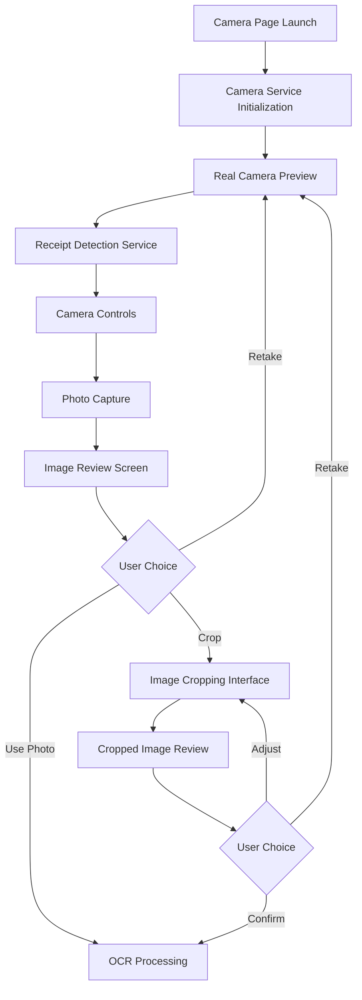
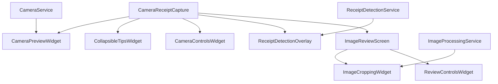

# Design Document

## Overview

This design addresses the camera page redesign for the SplitEase app, transforming the current mock-heavy implementation into a functional, professional camera interface for receipt capture. The solution focuses on integrating real camera functionality, implementing proper receipt detection, adding image cropping capabilities, and creating a streamlined user experience that eliminates fake UI elements and improves navigation flow.

## Architecture

### Camera Architecture Flow



### Component Architecture



## Components and Interfaces

### 1. Enhanced Camera Service

**Purpose**: Provide real camera functionality with flash control and proper initialization.

**Key Enhancements**:
- Real camera preview integration
- Flash toggle functionality
- Proper error handling and permissions
- Camera lifecycle management

**Interface**:
```dart
class CameraService {
  static CameraService get instance;
  
  Future<void> initialize();
  Future<void> setFlashMode(FlashMode mode);
  Future<FlashMode> getFlashMode();
  Future<File?> captureImage();
  Widget buildCameraPreview();
  bool get isInitialized;
  void dispose();
}
```

### 2. Receipt Detection Service

**Purpose**: Implement real receipt detection using image processing algorithms.

**Key Features**:
- Edge detection for rectangular documents
- Confidence scoring for detection accuracy
- Real-time detection feedback
- Boundary detection for cropping guidance

**Interface**:
```dart
class ReceiptDetectionService {
  static ReceiptDetectionService get instance;
  
  Stream<DetectionResult> detectReceipt(CameraImage image);
  Future<DetectionResult> analyzeStaticImage(File image);
  void startDetection();
  void stopDetection();
  
  // Enhanced methods for better user experience
  Future<void> calibrateDetection(File sampleImage);
  double getDetectionSensitivity();
  void setDetectionSensitivity(double sensitivity);
  bool get isCalibrated;
}

class DetectionResult {
  final bool isDetected;
  final double confidence;
  final List<Offset> boundaries;
  final Rect? boundingBox;
}
```

### 3. Collapsible Tips Widget

**Purpose**: Replace the large tips overlay with a collapsible, space-efficient version.

**Key Features**:
- Minimized by default
- Expandable on user interaction
- Smooth animations
- Contextual tips based on detection state

**Interface**:
```dart
class CollapsibleTipsWidget extends StatefulWidget {
  final bool isExpanded;
  final VoidCallback onToggle;
  final List<String> tips;
  
  const CollapsibleTipsWidget({
    required this.isExpanded,
    required this.onToggle,
    required this.tips,
  });
}
```

### 4. Enhanced Camera Preview Widget

**Purpose**: Display real camera feed instead of grey placeholder.

**Key Features**:
- Real-time camera preview
- Proper aspect ratio handling
- Overlay support for detection indicators
- Performance optimization

**Interface**:
```dart
class CameraPreviewWidget extends StatelessWidget {
  final CameraController controller;
  final Widget? overlay;
  final bool showGuidelines;
  
  const CameraPreviewWidget({
    required this.controller,
    this.overlay,
    this.showGuidelines = true,
  });
}
```

### 5. Image Cropping Widget

**Purpose**: Allow users to crop captured images to focus on receipt content.

**Key Features**:
- Interactive crop boundaries
- Preset aspect ratios for receipts
- Real-time preview
- Gesture-based manipulation

**Interface**:
```dart
class ImageCroppingWidget extends StatefulWidget {
  final File imageFile;
  final Rect? initialCropRect;
  final Function(File croppedImage) onCropComplete;
  final VoidCallback onCancel;
  
  const ImageCroppingWidget({
    required this.imageFile,
    this.initialCropRect,
    required this.onCropComplete,
    required this.onCancel,
  });
}
```

### 6. Simplified Review Controls

**Purpose**: Replace fake quality assessment buttons with clean, functional controls.

**Key Features**:
- Simple retake/use photo options
- Optional crop functionality
- Clear visual feedback
- Consistent navigation behavior

**Interface**:
```dart
class ReviewControlsWidget extends StatelessWidget {
  final VoidCallback onRetake;
  final VoidCallback onUsePhoto;
  final VoidCallback? onCrop;
  final bool isProcessing;
  
  const ReviewControlsWidget({
    required this.onRetake,
    required this.onUsePhoto,
    this.onCrop,
    required this.isProcessing,
  });
}
```

## Data Models

### Camera State Model

```dart
class CameraState {
  final bool isInitialized;
  final bool hasPermission;
  final FlashMode flashMode;
  final String? errorMessage;
  final CameraController? controller;
  
  // Enhanced properties for better state management
  final bool isProcessing;
  final double? batteryLevel;
  final bool isLowLight;
  final CameraResolution resolution;
  
  const CameraState({
    required this.isInitialized,
    required this.hasPermission,
    required this.flashMode,
    this.errorMessage,
    this.controller,
    this.isProcessing = false,
    this.batteryLevel,
    this.isLowLight = false,
    this.resolution = CameraResolution.medium,
  });
}
```

### Detection State Model

```dart
class DetectionState {
  final bool isDetecting;
  final DetectionResult? currentResult;
  final List<DetectionResult> history;
  
  const DetectionState({
    required this.isDetecting,
    this.currentResult,
    required this.history,
  });
}
```

### Image Processing Model

```dart
class ImageProcessingResult {
  final File originalImage;
  final File? croppedImage;
  final Rect? cropBounds;
  final Map<String, dynamic> metadata;
  
  const ImageProcessingResult({
    required this.originalImage,
    this.croppedImage,
    this.cropBounds,
    required this.metadata,
  });
}
```

## Error Handling

### Camera Initialization Errors

1. **Permission Denied**: Show permission request dialog with clear instructions
2. **Camera Unavailable**: Fallback to gallery picker with explanation
3. **Initialization Timeout**: Retry mechanism with user feedback

### Detection Service Errors

1. **Processing Failures**: Graceful degradation to manual capture mode
2. **Performance Issues**: Automatic detection throttling
3. **False Positives**: Confidence threshold adjustment

### Image Processing Errors

1. **Crop Failures**: Fallback to original image with user notification
2. **File System Errors**: Proper error messages and retry options
3. **Memory Issues**: Image compression and optimization

## Testing Strategy

### Unit Tests

1. **Camera Service**
   - Initialization and disposal
   - Flash mode toggling
   - Image capture functionality
   - Error handling scenarios

2. **Receipt Detection Service**
   - Detection algorithm accuracy
   - Confidence scoring
   - Boundary detection precision
   - Performance under various conditions

3. **Image Processing**
   - Cropping functionality
   - File handling
   - Metadata preservation

### Integration Tests

1. **Camera Flow**
   - Complete capture workflow
   - Navigation between screens
   - State management consistency

2. **Detection Integration**
   - Real-time detection performance
   - UI responsiveness during detection
   - Detection result accuracy

### Widget Tests

1. **Camera Preview Widget**
   - Proper camera feed display
   - Overlay rendering
   - Responsive design

2. **Cropping Interface**
   - Gesture handling
   - Crop boundary manipulation
   - Preview accuracy

## Implementation Phases

### Phase 1: Camera Service Enhancement
- Implement real camera preview
- Add flash toggle functionality
- Enhance error handling and permissions
- Replace grey placeholder with actual camera feed

### Phase 2: UI Redesign
- Create collapsible tips widget
- Redesign camera overlay for better space utilization
- Remove fake quality assessment buttons
- Implement clean review interface

### Phase 3: Receipt Detection
- Implement basic edge detection algorithm
- Add real-time detection feedback
- Create detection confidence system
- Integrate detection with UI overlay

### Phase 4: Image Cropping
- Implement image cropping interface
- Add gesture-based crop manipulation
- Integrate cropping with review workflow
- Add crop preview functionality

### Phase 5: Navigation Enhancement
- Fix back button behavior consistency
- Implement proper navigation stack management
- Add confirmation dialogs where appropriate
- Ensure smooth transitions between screens

## Technical Considerations

### Performance Optimization

1. **Camera Preview**: Use appropriate resolution presets to balance quality and performance
2. **Detection Processing**: Implement frame throttling to prevent UI blocking
3. **Image Handling**: Compress images appropriately for processing and storage
4. **Memory Management**: Proper disposal of camera resources and image data

### Platform Compatibility

1. **iOS Considerations**: Handle camera permissions and lifecycle properly
2. **Android Considerations**: Support various camera implementations and permissions
3. **Device Variations**: Adapt UI for different screen sizes and camera capabilities

### Accessibility

1. **Screen Reader Support**: Proper semantic labels for camera controls
2. **High Contrast**: Ensure UI elements are visible in various lighting conditions
3. **Gesture Alternatives**: Provide button alternatives for gesture-based interactions

## Future Enhancements

### Advanced Detection Features
- Machine learning-based receipt detection
- Automatic perspective correction
- Multi-receipt detection in single image

### Enhanced Cropping
- Automatic crop suggestions based on detection
- Batch processing for multiple receipts
- Smart boundary adjustment

### Camera Features
- Zoom functionality
- Focus control
- Exposure adjustment
- Multiple camera support (front/back)

## Dependencies

### Required Packages
- `camera`: For camera functionality
- `image`: For image processing and cropping
- `path_provider`: For file system operations
- `permission_handler`: For camera permissions

### Optional Packages
- `image_cropper`: Alternative cropping implementation
- `flutter_image_compress`: For image optimization
- `opencv_dart`: For advanced image processing (if needed)

## Migration Strategy

### Backward Compatibility
- Maintain existing API contracts during transition
- Gradual rollout of new features
- Fallback mechanisms for unsupported devices

### Data Migration
- No data migration required (camera functionality only)
- Preserve existing image processing pipeline compatibility
- Maintain OCR service integration points