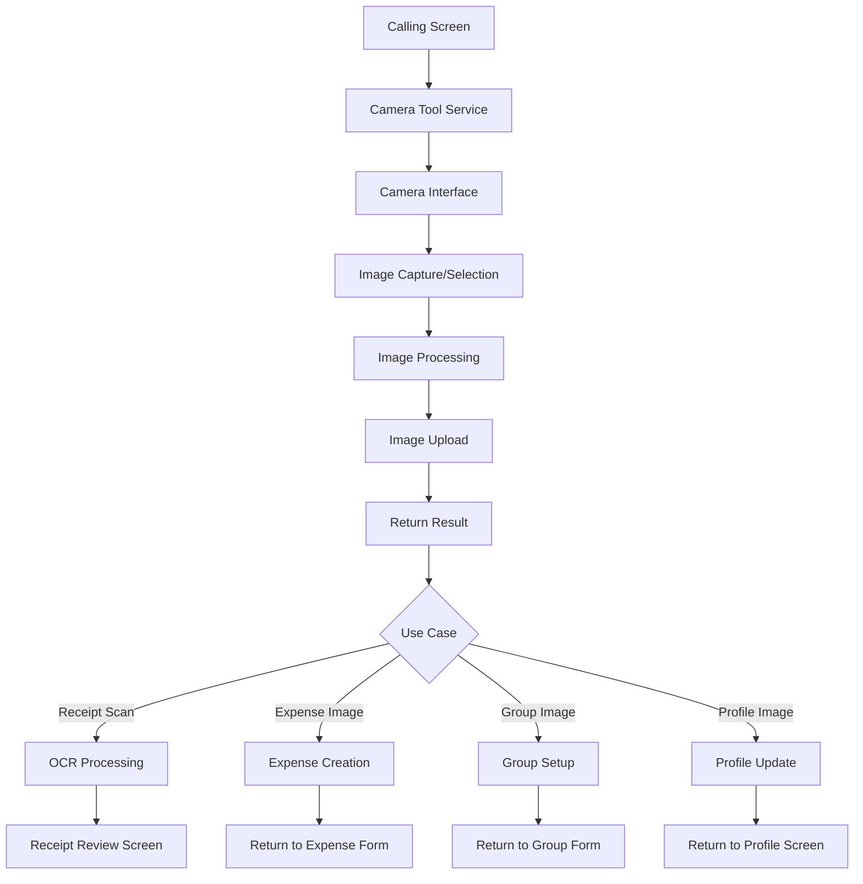
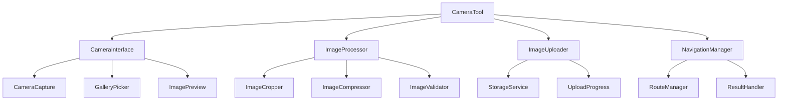

# Design Document

## Overview

This design addresses the refactoring of camera functionality in the SplitEase app to create a reusable, workflow-agnostic camera tool. The current implementation tightly couples camera functionality with receipt scanning, causing navigation issues and preventing reuse across different features. The solution involves creating a standalone camera service that can be used for expense images, group images, profile pictures, and receipt scanning, while maintaining consistent user experience and proper navigation flow.

## Architecture

### High-Level Architecture Flow



### Component Architecture



## Components and Interfaces

### 1. Camera Tool Service

**Purpose**: Main orchestrator that provides camera functionality as a service to different parts of the app.

**Key Features**:
- Workflow-agnostic camera operations
- Configurable for different use cases
- Consistent return interface
- Proper navigation management

**Interface**:
```dart
class CameraToolService {
  static CameraToolService get instance;
  
  Future<CameraResult?> captureImage({
    required CameraUseCase useCase,
    required BuildContext context,
    CameraConfig? config,
  });
  
  Future<CameraResult?> selectImage({
    required CameraUseCase useCase,
    required BuildContext context,
    CameraConfig? config,
  });
  
  Future<CameraResult?> showCameraOptions({
    required CameraUseCase useCase,
    required BuildContext context,
    CameraConfig? config,
  });
}

enum CameraUseCase {
  receiptScan,
  expenseImage,
  groupImage,
  profileImage,
}

class CameraConfig {
  final bool allowGallerySelection;
  final bool requireCropping;
  final double? aspectRatio;
  final int? maxWidth;
  final int? maxHeight;
  final int compressionQuality;
  final bool autoUpload;
  final String? uploadPath;
  
  const CameraConfig({
    this.allowGallerySelection = true,
    this.requireCropping = false,
    this.aspectRatio,
    this.maxWidth,
    this.maxHeight,
    this.compressionQuality = 85,
    this.autoUpload = true,
    this.uploadPath,
  });
}

class CameraResult {
  final File imageFile;
  final String? uploadUrl;
  final Map<String, dynamic>? metadata;
  final CameraUseCase useCase;
  
  const CameraResult({
    required this.imageFile,
    this.uploadUrl,
    this.metadata,
    required this.useCase,
  });
}
```

### 2. Unified Camera Interface

**Purpose**: Refactors the existing `CameraReceiptCapture` component to be reusable across different use cases.

**Key Features**:
- Extracts and generalizes the existing camera interface from `CameraReceiptCapture`
- Reuses existing widgets: `CameraControlsWidget`, `CameraOverlayWidget`, `ReceiptPreviewWidget`
- Configurable UI elements and behavior based on use case
- Maintains the same high-quality camera experience users are familiar with
- Support for both capture and gallery selection

**Refactoring Approach**:
The existing `CameraReceiptCapture` will be refactored into:

1. **`UnifiedCameraInterface`** - The main camera screen that can be configured for different use cases
2. **Reusable Widgets** - Extract and generalize existing widgets:
   - `CameraControlsWidget` (already exists, will be enhanced)
   - `CameraPreviewWidget` (extracted from current implementation)
   - `ImageReviewWidget` (generalized from `ReceiptPreviewWidget`)
   - `CameraOverlayWidget` (modified to be use-case aware)

**Interface**:
```dart
class UnifiedCameraInterface extends StatefulWidget {
  final CameraUseCase useCase;
  final CameraConfig config;
  final Function(CameraResult) onResult;
  final VoidCallback onCancel;
  
  const UnifiedCameraInterface({
    required this.useCase,
    required this.config,
    required this.onResult,
    required this.onCancel,
    super.key,
  });
}

// Refactored from existing CameraReceiptCapture logic
class CameraInterfaceController {
  Future<void> captureImage();
  Future<void> selectFromGallery();
  Future<void> retakeImage();
  Future<void> confirmImage();
  Future<void> cropImage();
  void toggleFlash();
  void switchCamera();
}
```

**Widget Reuse Strategy**:
- **`CameraControlsWidget`**: Already exists, will be enhanced to support gallery picker option
- **`CameraOverlayWidget`**: Will be modified to show different overlays based on use case (receipt detection for receipts, simple guidelines for other images)
- **`ReceiptPreviewWidget`**: Will be generalized to `ImageReviewWidget` for all image types
- **Camera Service**: Will reuse the existing `CameraService` with enhancements

### 3. Image Processing Pipeline

**Purpose**: Handles image processing tasks like cropping, compression, and validation.

**Key Features**:
- Configurable processing based on use case
- Consistent image quality across the app
- Memory-efficient processing
- Error handling and fallbacks

**Interface**:
```dart
class ImageProcessor {
  static ImageProcessor get instance;
  
  Future<File> processImage({
    required File inputFile,
    required CameraConfig config,
    CameraUseCase? useCase,
  });
  
  Future<File> cropImage({
    required File inputFile,
    Rect? cropRect,
    double? aspectRatio,
  });
  
  Future<File> compressImage({
    required File inputFile,
    int quality = 85,
    int? maxWidth,
    int? maxHeight,
  });
  
  Future<bool> validateImage({
    required File imageFile,
    CameraUseCase? useCase,
  });
}
```

### 4. Image Upload Manager

**Purpose**: Handles image uploads with progress tracking and error handling.

**Key Features**:
- Use case-specific upload paths
- Progress tracking
- Retry mechanisms
- Consistent error handling

**Interface**:
```dart
class ImageUploadManager {
  static ImageUploadManager get instance;
  
  Future<String> uploadImage({
    required File imageFile,
    required CameraUseCase useCase,
    String? customPath,
    Function(double)? onProgress,
  });
  
  Future<void> cancelUpload(String uploadId);
  
  Stream<UploadProgress> getUploadProgress(String uploadId);
}

class UploadProgress {
  final String uploadId;
  final double progress;
  final UploadStatus status;
  final String? error;
  
  const UploadProgress({
    required this.uploadId,
    required this.progress,
    required this.status,
    this.error,
  });
}

enum UploadStatus {
  pending,
  uploading,
  completed,
  failed,
  cancelled,
}
```

### 5. Navigation Manager

**Purpose**: Manages navigation flow and ensures proper return to calling screens.

**Key Features**:
- Context-aware navigation
- Proper navigation stack management
- Result passing between screens
- Error state handling

**Interface**:
```dart
class CameraNavigationManager {
  static CameraNavigationManager get instance;
  
  Future<CameraResult?> navigateToCamera({
    required BuildContext context,
    required CameraUseCase useCase,
    CameraConfig? config,
  });
  
  void returnWithResult({
    required BuildContext context,
    required CameraResult result,
  });
  
  void returnWithCancel({
    required BuildContext context,
  });
  
  void handlePostCameraFlow({
    required BuildContext context,
    required CameraResult result,
  });
}
```

### 6. Use Case Handlers

**Purpose**: Handle specific logic for different camera use cases after image capture.

**Key Features**:
- Receipt scanning integration with OCR
- Expense image handling
- Group image processing
- Profile image updates

**Interface**:
```dart
abstract class CameraUseCaseHandler {
  Future<void> handleResult({
    required BuildContext context,
    required CameraResult result,
  });
}

class ReceiptScanHandler extends CameraUseCaseHandler {
  @override
  Future<void> handleResult({
    required BuildContext context,
    required CameraResult result,
  }) async {
    // Process through OCR and navigate to receipt review
    final ocrResponse = await ApiService.instance.processReceipt(result.imageFile);
    Navigator.pushReplacementNamed(
      context,
      AppRoutes.receiptOcrReview,
      arguments: {
        'ocrResult': ocrResponse,
        'imagePath': result.imageFile.path,
      },
    );
  }
}

class ExpenseImageHandler extends CameraUseCaseHandler {
  @override
  Future<void> handleResult({
    required BuildContext context,
    required CameraResult result,
  }) async {
    // Return to expense creation with image URL
    Navigator.pop(context, result);
  }
}

class GroupImageHandler extends CameraUseCaseHandler {
  @override
  Future<void> handleResult({
    required BuildContext context,
    required CameraResult result,
  }) async {
    // Update group image and return
    Navigator.pop(context, result);
  }
}

class ProfileImageHandler extends CameraUseCaseHandler {
  @override
  Future<void> handleResult({
    required BuildContext context,
    required CameraResult result,
  }) async {
    // Update profile image and return
    Navigator.pop(context, result);
  }
}
```

## Data Models

### Camera Configuration Model

```dart
class CameraUseCaseConfig {
  static const Map<CameraUseCase, CameraConfig> defaultConfigs = {
    CameraUseCase.receiptScan: CameraConfig(
      allowGallerySelection: true,
      requireCropping: false,
      compressionQuality: 90,
      autoUpload: false, // OCR handles upload
    ),
    CameraUseCase.expenseImage: CameraConfig(
      allowGallerySelection: true,
      requireCropping: false,
      compressionQuality: 85,
      autoUpload: true,
      uploadPath: '/expense-images',
    ),
    CameraUseCase.groupImage: CameraConfig(
      allowGallerySelection: true,
      requireCropping: true,
      aspectRatio: 1.0, // Square aspect ratio
      maxWidth: 500,
      maxHeight: 500,
      compressionQuality: 80,
      autoUpload: true,
      uploadPath: '/group-images',
    ),
    CameraUseCase.profileImage: CameraConfig(
      allowGallerySelection: true,
      requireCropping: true,
      aspectRatio: 1.0, // Square aspect ratio
      maxWidth: 300,
      maxHeight: 300,
      compressionQuality: 80,
      autoUpload: true,
      uploadPath: '/profile-images',
    ),
  };
}
```

### Camera State Model

```dart
class CameraToolState {
  final bool isInitialized;
  final bool isCapturing;
  final bool isProcessing;
  final bool isUploading;
  final String? currentImagePath;
  final CameraUseCase? currentUseCase;
  final String? error;
  final double? uploadProgress;
  
  const CameraToolState({
    required this.isInitialized,
    required this.isCapturing,
    required this.isProcessing,
    required this.isUploading,
    this.currentImagePath,
    this.currentUseCase,
    this.error,
    this.uploadProgress,
  });
}
```

## Error Handling

### Camera Tool Errors

1. **Initialization Failures**: Graceful fallback to gallery picker
2. **Permission Denied**: Clear permission request flow with instructions
3. **Upload Failures**: Retry mechanisms with offline support
4. **Processing Errors**: Fallback to original image with user notification

### Use Case Specific Errors

1. **Receipt Scan Failures**: Fallback to manual item entry
2. **Image Upload Failures**: Local storage with retry queue
3. **Navigation Errors**: Proper error boundaries and recovery

## Testing Strategy

### Unit Tests

1. **Camera Tool Service**
   - Use case configuration
   - Result handling
   - Error scenarios

2. **Image Processing Pipeline**
   - Cropping accuracy
   - Compression quality
   - Validation logic

3. **Upload Manager**
   - Upload progress tracking
   - Retry mechanisms
   - Error handling

### Integration Tests

1. **Complete Camera Flows**
   - Receipt scanning workflow
   - Expense image workflow
   - Group image workflow
   - Profile image workflow

2. **Navigation Testing**
   - Proper return navigation
   - State preservation
   - Error recovery

### Widget Tests

1. **Unified Camera Interface**
   - UI configuration for different use cases
   - Control functionality
   - State management

## Implementation Phases

### Phase 1: Extract and Generalize Existing Camera Interface
- Extract reusable components from `CameraReceiptCapture`
- Create `UnifiedCameraInterface` based on existing implementation
- Generalize `ReceiptPreviewWidget` to `ImageReviewWidget`
- Enhance `CameraControlsWidget` to support gallery picker

### Phase 2: Create Camera Tool Service Layer
- Implement `CameraToolService` with use case configuration
- Create `CameraConfig` and `CameraResult` models
- Implement navigation manager for different return flows
- Set up use case handler system

### Phase 3: Image Processing Pipeline
- Extract image processing logic from existing implementation
- Implement `ImageProcessor` with cropping and compression
- Create `ImageUploadManager` with progress tracking
- Add validation and error handling

### Phase 4: Use Case Handlers Implementation
- Implement `ReceiptScanHandler` (maintains current OCR flow)
- Create `ExpenseImageHandler` for expense image workflow
- Implement `GroupImageHandler` for group image selection
- Create `ProfileImageHandler` for profile picture updates

### Phase 5: Integration with Existing Features
- Update expense creation to use camera tool for image selection
- Integrate camera tool with group creation/editing
- Replace existing profile image picker with camera tool
- Maintain receipt scanning workflow with refactored components

### Phase 6: Migration and Cleanup
- Gradually migrate from old `CameraReceiptCapture` to `UnifiedCameraInterface`
- Remove duplicate camera code
- Update all navigation flows
- Comprehensive testing and optimization

## Migration Strategy

### Backward Compatibility

1. **Existing Receipt Scanning**: Gradually migrate to use camera tool while maintaining current functionality
2. **API Compatibility**: Ensure existing OCR integration continues to work
3. **Navigation Preservation**: Maintain current navigation patterns during transition

### Gradual Rollout

1. **Phase 1**: Implement camera tool service without breaking existing functionality
2. **Phase 2**: Migrate receipt scanning to use camera tool
3. **Phase 3**: Add camera tool to other features
4. **Phase 4**: Remove old camera implementations

## Technical Considerations

### Performance Optimization

1. **Memory Management**: Proper disposal of camera resources and image data
2. **Image Processing**: Efficient cropping and compression algorithms
3. **Upload Optimization**: Background uploads with progress tracking
4. **Cache Management**: Proper cleanup of temporary files

### Platform Compatibility

1. **iOS/Android Differences**: Handle platform-specific camera behaviors
2. **Permission Handling**: Consistent permission flow across platforms
3. **File System**: Platform-appropriate file storage and cleanup

### Security Considerations

1. **Image Privacy**: Secure upload and storage of sensitive images
2. **Permission Management**: Proper camera and storage permissions
3. **Data Validation**: Validate uploaded images for security

## Future Enhancements

### Advanced Features
- Batch image processing
- Advanced cropping with AI assistance
- Image quality enhancement
- OCR preview for non-receipt images

### User Experience
- Gesture-based controls
- Voice commands for accessibility
- Offline mode with sync
- Image editing capabilities

## Dependencies

### Required Packages
- `camera`: Camera functionality
- `image`: Image processing
- `image_cropper`: Image cropping interface
- `image_picker`: Gallery selection
- `path_provider`: File system operations
- `permission_handler`: Camera permissions

### Internal Dependencies
- Existing CameraService (to be refactored)
- ApiService for uploads
- ProfileImageService integration
- Navigation system integration