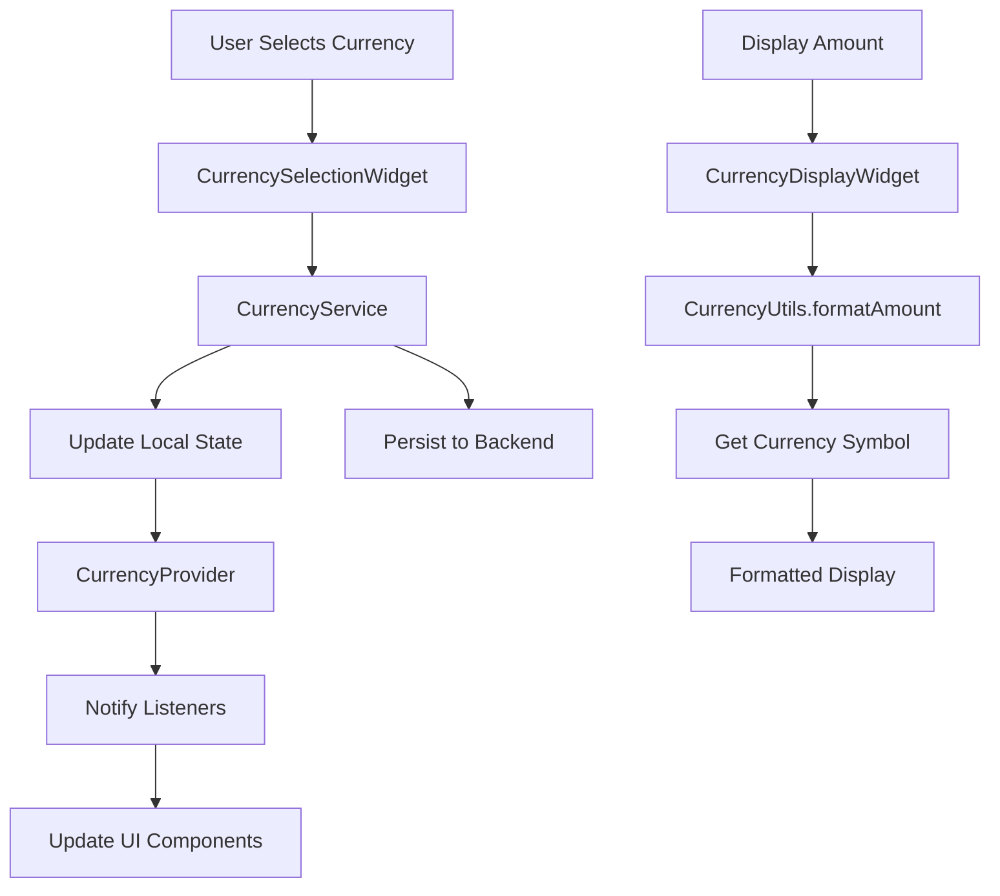

# Design Document

## Overview

The currency unification feature will standardize all currency-related functionality across the CamSplit application by creating a centralized currency management system. This system will replace the current inconsistent currency handling with a unified approach that uses the Currency object from the currency_picker package as the single source of truth for all currency operations.

The design focuses on creating reusable components and services that can be easily integrated across the existing codebase while maintaining backward compatibility and ensuring consistent user experience.

## Architecture

### Core Components

1. **CurrencyService** - Centralized service for currency management
2. **CurrencySelectionWidget** - Reusable currency picker component
3. **CurrencyDisplayWidget** - Standardized currency amount display component
4. **CurrencyUtils** - Utility functions for currency formatting and conversion
5. **CurrencyProvider** - State management for currency preferences

### Data Flow



### Integration Points

- **Profile Settings**: User's preferred currency selection
- **Group Management**: Group-specific currency settings
- **Expense Creation/Editing**: Expense currency selection with group defaults
- **All Amount Displays**: Consistent currency symbol display throughout the app

## Components and Interfaces

### CurrencyService

```dart
class CurrencyService {
  static Currency getDefaultCurrency();
  static Future<void> setUserPreferredCurrency(Currency currency);
  static Currency getUserPreferredCurrency();
  static Currency getGroupCurrency(int groupId);
  static Future<void> setGroupCurrency(int groupId, Currency currency);
  static Currency getExpenseCurrency(int expenseId);
  static List<Currency> getPopularCurrencies();
  static Currency getCurrencyByCode(String code);
  static String formatAmount(double amount, Currency currency);
}
```

### CurrencySelectionWidget

```dart
class CurrencySelectionWidget extends StatelessWidget {
  final Currency? selectedCurrency;
  final Function(Currency) onCurrencySelected;
  final bool showFlag;
  final bool showCurrencyName;
  final bool showCurrencyCode;
  final String? labelText;
  final bool isEnabled;
  
  // Provides consistent currency selection UI across the app
}
```

### CurrencyDisplayWidget

```dart
class CurrencyDisplayWidget extends StatelessWidget {
  final double amount;
  final Currency currency;
  final TextStyle? style;
  final bool isPrivacyMode;
  final int decimalPlaces;
  final bool showCurrencyCode;
  
  // Provides consistent currency amount display
}
```

### CurrencyUtils

```dart
class CurrencyUtils {
  static String formatAmount(double amount, Currency currency, {int? decimalPlaces});
  static String getCurrencySymbol(String currencyCode);
  static Currency parseCurrencyCode(String code);
  static bool isValidCurrencyCode(String code);
  static Currency getSystemDefaultCurrency();
}
```

## Data Models

### Enhanced Currency Storage

The existing models will be updated to use Currency objects instead of string codes:

```dart
// Updated UserPreferences
class UserPreferences {
  final Currency currency; // Changed from String to Currency
  // ... other fields
}

// Updated Group model
class Group {
  final Currency currency; // Changed from String to Currency
  // ... other fields
}

// Updated ExpenseDetailModel
class ExpenseDetailModel {
  final Currency currency; // Changed from String to Currency
  // ... other fields
}
```

### Migration Strategy

To maintain backward compatibility during the transition:

1. **Dual Storage**: Temporarily store both Currency object and string code
2. **Graceful Fallback**: If Currency object is null, fall back to string code
3. **Progressive Migration**: Update components one by one
4. **Data Validation**: Ensure all currency codes can be converted to Currency objects

## Error Handling

### Currency Resolution Errors

1. **Invalid Currency Code**: Fall back to user's preferred currency or system default
2. **Missing Currency Data**: Use EUR as ultimate fallback
3. **Network Errors**: Use cached currency preferences
4. **Parsing Errors**: Log error and use safe defaults

### User Experience

1. **Loading States**: Show loading indicators during currency operations
2. **Error Messages**: Clear, actionable error messages for currency-related failures
3. **Offline Support**: Cache currency preferences locally
4. **Validation**: Real-time validation of currency selections

## Testing Strategy

### Unit Tests

1. **CurrencyService Tests**
   - Currency preference storage and retrieval
   - Currency code validation
   - Amount formatting with different currencies
   - Error handling for invalid currencies

2. **CurrencyUtils Tests**
   - Currency symbol resolution
   - Amount formatting edge cases
   - Currency code parsing
   - Locale-based default currency detection

3. **Widget Tests**
   - CurrencySelectionWidget interaction
   - CurrencyDisplayWidget rendering
   - Currency change propagation
   - Error state handling

### Integration Tests

1. **End-to-End Currency Flow**
   - Set preferred currency in profile
   - Create group with specific currency
   - Create expense with group currency default
   - Verify currency display consistency

2. **Migration Testing**
   - Test backward compatibility with existing data
   - Verify smooth transition from string codes to Currency objects
   - Test data integrity during migration

3. **Cross-Platform Testing**
   - Currency symbol display on different devices
   - Locale-specific currency behavior
   - Performance with large currency lists

### Manual Testing Scenarios

1. **Currency Selection Consistency**
   - Test all currency selection points use same interface
   - Verify currency changes reflect immediately in UI
   - Test currency cascading from group to expense

2. **Symbol Display Accuracy**
   - Test all hardcoded symbols are replaced
   - Verify correct symbols for different currencies
   - Test symbol positioning and formatting

3. **User Workflow Testing**
   - Complete user journey with currency changes
   - Test edge cases like changing group currency
   - Verify privacy mode works with all currencies

## Implementation Phases

### Phase 1: Core Infrastructure
- Create CurrencyService and CurrencyUtils
- Implement CurrencySelectionWidget
- Set up basic currency preference storage

### Phase 2: Widget Standardization
- Create CurrencyDisplayWidget
- Replace hardcoded currency symbols
- Update expense creation currency selection

### Phase 3: Group Integration
- Update group creation/editing currency selection
- Implement currency cascading from group to expense
- Update group detail views

### Phase 4: Profile Integration
- Update profile settings currency selection
- Implement user preferred currency defaults
- Add locale-based currency detection

### Phase 5: Migration and Cleanup
- Migrate existing data to use Currency objects
- Remove deprecated string-based currency handling
- Performance optimization and cleanup