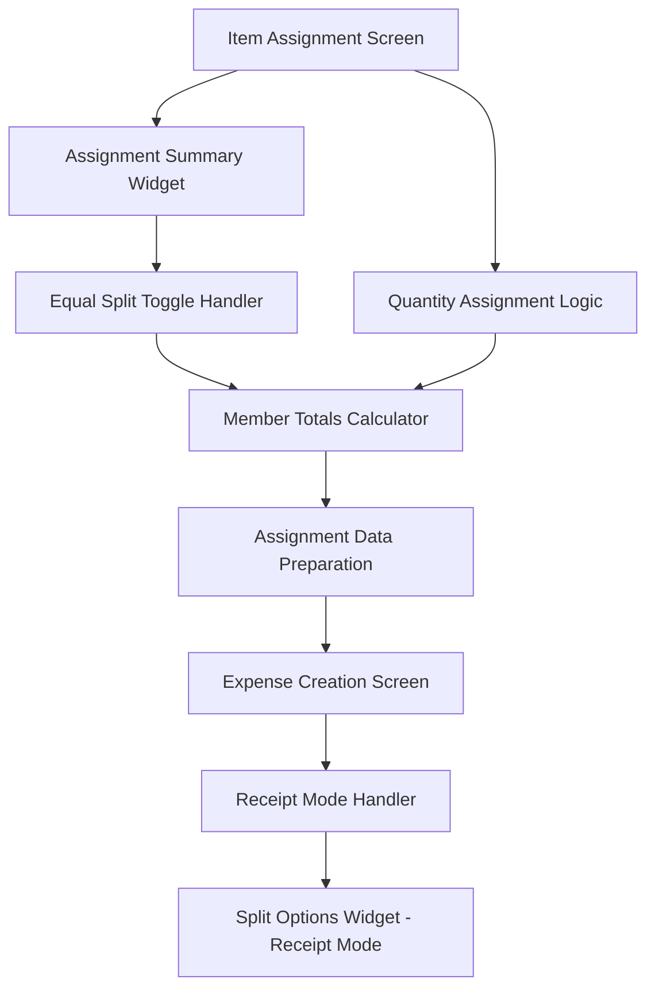

# Design Document

## Overview

This design addresses the receipt mode improvements for the SplitEase app, focusing on fixing the assignment summary state management and implementing a proper receipt mode for expense creation. The solution involves enhancing the existing `AssignmentSummaryWidget` to properly handle equal split toggling and modifying the `ExpenseCreation` screen to support a locked receipt mode with pre-filled data.

## Architecture

### Data Flow Architecture



### State Management Strategy

The design implements a clear separation of concerns:
- **Assignment State**: Managed in `ItemAssignment` screen
- **Summary State**: Calculated in `AssignmentSummaryWidget` based on assignment data
- **Receipt Mode State**: Managed in `ExpenseCreation` screen with immutable data

## Components and Interfaces

### 1. Enhanced Assignment Summary Widget

**Purpose**: Fix the equal split toggle behavior to properly show individual assignments when toggled off.

**Key Changes**:
- Add state tracking for previous individual assignments
- Implement proper state restoration when equal split is disabled
- Maintain separate calculation paths for equal split vs individual assignments

**Interface**:
```dart
class AssignmentSummaryWidget extends StatefulWidget {
  final List<Map<String, dynamic>> items;
  final List<Map<String, dynamic>> members;
  final bool isEqualSplit;
  final VoidCallback onToggleEqualSplit;
  final VoidCallback? onAddParticipant;
  final List<Map<String, dynamic>>? quantityAssignments;
  
  // New properties for state management
  final Map<String, double>? previousIndividualTotals;
  final Function(Map<String, double>)? onIndividualTotalsChanged;
}
```

### 2. Receipt Mode Data Transfer

**Purpose**: Properly transfer assignment data from item assignment to expense creation.

**Data Structure**:
```dart
class ReceiptModeData {
  final double total;
  final List<ParticipantAmount> participantAmounts;
  final String mode; // 'receipt'
  final bool isEqualSplit;
  final List<Map<String, dynamic>> items;
  final List<Map<String, dynamic>> groupMembers;
  final List<Map<String, dynamic>>? quantityAssignments;
}

class ParticipantAmount {
  final String name;
  final double amount;
}
```

### 3. Enhanced Expense Creation Screen

**Purpose**: Support receipt mode with locked UI elements and pre-filled data.

**Key Changes**:
- Add receipt mode detection and state management
- Implement UI element locking for receipt mode
- Pre-fill split options with custom amounts
- Disable editing for receipt mode fields

**Interface**:
```dart
class ExpenseCreation extends StatefulWidget {
  final String mode; // 'manual' or 'receipt'
  final ReceiptModeData? receiptData; // New parameter for receipt mode
}
```

### 4. Enhanced Split Options Widget

**Purpose**: Support receipt mode with pre-filled, non-editable custom amounts.

**Key Changes**:
- Add receipt mode parameter
- Implement read-only custom amounts display
- Disable split type selection in receipt mode
- Show receipt mode indicator

**Interface**:
```dart
class SplitOptionsWidget extends StatefulWidget {
  // Existing parameters...
  final bool isReceiptMode; // New parameter
  final Map<String, double>? prefilledCustomAmounts; // New parameter
}
```

## Data Models

### Assignment Summary State Model

```dart
class AssignmentSummaryState {
  final Map<String, double> currentTotals;
  final Map<String, double> individualTotals;
  final Map<String, double> equalSplitTotals;
  final bool isEqualSplit;
  final double totalAmount;
  
  AssignmentSummaryState({
    required this.currentTotals,
    required this.individualTotals,
    required this.equalSplitTotals,
    required this.isEqualSplit,
    required this.totalAmount,
  });
}
```

### Receipt Mode Configuration

```dart
class ReceiptModeConfig {
  final bool isGroupEditable;
  final bool isTotalEditable;
  final bool isSplitTypeEditable;
  final bool areCustomAmountsEditable;
  final String defaultSplitType;
  
  static const ReceiptModeConfig receiptMode = ReceiptModeConfig(
    isGroupEditable: false,
    isTotalEditable: false,
    isSplitTypeEditable: false,
    areCustomAmountsEditable: false,
    defaultSplitType: 'custom',
  );
}
```

## Error Handling

### Assignment Summary Error Handling

1. **Invalid Assignment State**: When assignment data is inconsistent
   - Fallback to recalculating from items
   - Show warning to user about data inconsistency

2. **Missing Individual Assignments**: When equal split is toggled off but no individual assignments exist
   - Show zero amounts for all participants
   - Display clear message about needing to assign items

3. **Calculation Errors**: When totals don't match expected values
   - Log error for debugging
   - Use fallback calculation method

### Receipt Mode Error Handling

1. **Missing Receipt Data**: When receipt mode is requested but data is incomplete
   - Fallback to manual mode
   - Show error message to user

2. **Data Validation Errors**: When receipt data doesn't pass validation
   - Show specific validation errors
   - Allow user to return to item assignment

3. **UI State Errors**: When receipt mode UI fails to initialize properly
   - Fallback to editable mode with warning
   - Log error for debugging

## Testing Strategy

### Unit Tests

1. **Assignment Summary Logic**
   - Test equal split calculations
   - Test individual assignment calculations
   - Test state transitions between equal split and individual modes
   - Test edge cases (empty assignments, single member, etc.)

2. **Receipt Mode Data Transfer**
   - Test data serialization/deserialization
   - Test data validation
   - Test error handling for invalid data

3. **Split Options Widget Receipt Mode**
   - Test read-only mode functionality
   - Test pre-filled data display
   - Test disabled state handling

### Integration Tests

1. **End-to-End Receipt Flow**
   - Test complete flow from item assignment to expense creation
   - Test data consistency across screens
   - Test UI state management

2. **Equal Split Toggle Behavior**
   - Test toggling equal split on and off
   - Test state preservation and restoration
   - Test UI updates and calculations

### Widget Tests

1. **Assignment Summary Widget**
   - Test UI rendering for different states
   - Test user interactions (toggle, add participant)
   - Test accessibility features

2. **Expense Creation Receipt Mode**
   - Test receipt mode UI rendering
   - Test disabled field behavior
   - Test data display accuracy

## Implementation Phases

### Phase 1: Assignment Summary Fix
- Enhance `AssignmentSummaryWidget` with proper state management
- Implement individual totals tracking
- Fix equal split toggle behavior
- Add comprehensive testing

### Phase 2: Receipt Mode Data Transfer
- Implement `ReceiptModeData` structure
- Enhance data passing between screens
- Add data validation and error handling
- Update navigation logic

### Phase 3: Receipt Mode UI
- Enhance `ExpenseCreation` screen for receipt mode
- Implement UI element locking
- Update `SplitOptionsWidget` for receipt mode
- Add receipt mode indicators

### Phase 4: Integration and Testing
- Comprehensive testing of the complete flow
- Performance optimization
- Accessibility improvements
- Documentation updates

## Future Considerations

### Group Management Integration
- Design allows for easy integration with future group selection features
- Mock data handling is isolated and can be easily replaced
- Group state management is prepared for dynamic group selection

### Scalability
- Component design supports large numbers of participants
- State management is optimized for performance
- UI components are responsive and accessible

### Extensibility
- Receipt mode design can be extended for other pre-filled scenarios
- Assignment logic can support additional assignment types
- Data models are flexible for future enhancements