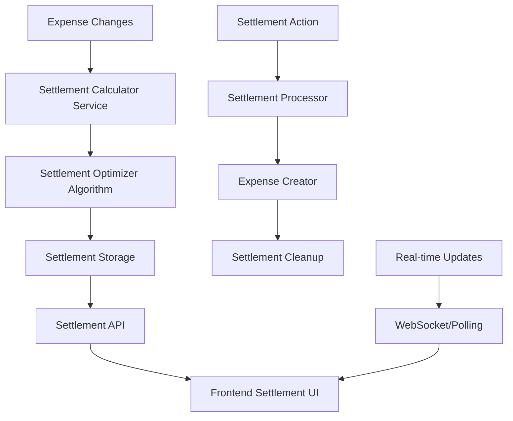

# Settlement Optimization Design Document

## Overview

The settlement optimization feature implements an intelligent debt resolution system that minimizes the number of transactions needed to settle all debts within a group. The system calculates optimal settlements using a debt simplification algorithm and provides mechanisms to convert settlements into expense records when marked as "settled."

The feature builds upon the existing expense and payment infrastructure, leveraging the current `payments` table while adding new settlement calculation logic and a dedicated settlements storage mechanism.

## Architecture

### High-Level Architecture



### Data Flow

1. **Calculation Trigger**: Expense CRUD operations trigger settlement recalculation
2. **Debt Analysis**: System analyzes all expense payers and splits to determine net balances
3. **Optimization**: Algorithm minimizes transactions using debt simplification
4. **Storage**: Optimized settlements are stored in the settlements table
5. **Real-time Updates**: Frontend receives updated settlement data
6. **Settlement Processing**: When marked as settled, settlements convert to expenses

## Components and Interfaces

### 1. Settlement Model (`Settlement.js`)

**Purpose**: Manages settlement data and database operations

**Key Methods**:
- `static async calculateOptimalSettlements(groupId)`: Calculate and store optimal settlements
- `static async getSettlementsForGroup(groupId)`: Retrieve active settlements
- `static async markAsSettled(settlementId, userId)`: Convert settlement to expense
- `static async getSettlementHistory(groupId)`: Retrieve settlement history

**Database Schema**:
```sql
CREATE TABLE settlements (
  id SERIAL PRIMARY KEY,
  group_id INTEGER REFERENCES groups(id) ON DELETE CASCADE,
  from_group_member_id INTEGER REFERENCES group_members(id) ON DELETE CASCADE,
  to_group_member_id INTEGER REFERENCES group_members(id) ON DELETE CASCADE,
  amount DECIMAL(10,2) NOT NULL,
  currency VARCHAR(3) DEFAULT 'EUR',
  status VARCHAR(20) DEFAULT 'active', -- 'active', 'settled', 'obsolete'
  calculation_timestamp TIMESTAMP WITH TIME ZONE DEFAULT NOW(),
  settled_at TIMESTAMP WITH TIME ZONE,
  settled_by INTEGER REFERENCES users(id),
  created_expense_id INTEGER REFERENCES expenses(id),
  created_at TIMESTAMP WITH TIME ZONE DEFAULT NOW(),
  updated_at TIMESTAMP WITH TIME ZONE DEFAULT NOW()
);
```

### 2. Settlement Calculator Service (`SettlementCalculatorService.js`)

**Purpose**: Core business logic for debt optimization

**Key Methods**:
- `calculateGroupBalances(groupId)`: Analyze expense data to determine net balances
- `optimizeSettlements(balances)`: Apply debt simplification algorithm
- `validateSettlements(settlements)`: Ensure settlement integrity

**Algorithm**: Uses a greedy approach to minimize transactions:
1. Calculate net balance for each group member
2. Separate creditors (positive balance) and debtors (negative balance)
3. Match largest debtor with largest creditor iteratively
4. Continue until all balances are zero

### 3. Settlement Controller (`settlementController.js`)

**Purpose**: HTTP API endpoints for settlement operations

**Endpoints**:
- `GET /api/groups/:groupId/settlements`: Get active settlements
- `POST /api/settlements/:settlementId/settle`: Mark settlement as settled
- `GET /api/groups/:groupId/settlements/history`: Get settlement history
- `POST /api/groups/:groupId/settlements/recalculate`: Force recalculation

### 4. Settlement Processor Service (`SettlementProcessorService.js`)

**Purpose**: Handles settlement-to-expense conversion

**Key Methods**:
- `processSettlement(settlementId, userId)`: Convert settlement to expense
- `createSettlementExpense(settlementData)`: Create expense from settlement
- `cleanupObsoleteSettlements(groupId)`: Remove outdated settlements

### 5. Real-time Update Service (`SettlementUpdateService.js`)

**Purpose**: Manages real-time settlement updates

**Key Methods**:
- `triggerRecalculation(groupId, changeType)`: Debounced recalculation trigger
- `broadcastSettlementUpdate(groupId, settlements)`: Notify frontend of changes
- `scheduleRecalculation(groupId, delay)`: Batch multiple rapid changes

## Data Models

### Settlement Data Structure

```javascript
{
  id: 123,
  group_id: 456,
  from_group_member_id: 789,
  to_group_member_id: 101,
  amount: 45.50,
  currency: 'EUR',
  status: 'active',
  calculation_timestamp: '2024-01-15T10:30:00Z',
  settled_at: null,
  settled_by: null,
  created_expense_id: null,
  from_member: {
    id: 789,
    nickname: 'John',
    user_id: 12,
    user_avatar: 'avatar_url'
  },
  to_member: {
    id: 101,
    nickname: 'Jane',
    user_id: 34,
    user_avatar: 'avatar_url'
  }
}
```

### Group Balance Structure

```javascript
{
  member_id: 789,
  nickname: 'John',
  user_id: 12,
  total_paid: 150.00,
  total_owed: 75.00,
  balance: 75.00, // positive = creditor, negative = debtor
  user_avatar: 'avatar_url'
}
```

## Error Handling

### Settlement Calculation Errors

- **Insufficient Data**: Handle cases where expense data is incomplete
- **Calculation Timeout**: Implement timeout for large groups (>50 members)
- **Concurrent Modifications**: Handle race conditions during rapid expense changes
- **Database Constraints**: Manage foreign key violations and data integrity

### Settlement Processing Errors

- **Invalid Settlement**: Validate settlement exists and is active
- **Permission Errors**: Ensure user has rights to settle debts
- **Expense Creation Failures**: Handle failures in expense creation process
- **Cleanup Failures**: Ensure system remains consistent even if cleanup fails

### Error Response Format

```javascript
{
  error: true,
  message: "Settlement calculation failed",
  code: "SETTLEMENT_CALC_ERROR",
  details: {
    group_id: 456,
    error_type: "timeout",
    retry_after: 30
  }
}
```

## Testing Strategy

### Unit Tests

1. **Settlement Calculator Service**
   - Test debt optimization algorithm with various balance scenarios
   - Verify edge cases (zero balances, single member, circular debts)
   - Test performance with large member counts

2. **Settlement Model**
   - Test CRUD operations
   - Verify data validation and constraints
   - Test concurrent access scenarios

3. **Settlement Processor Service**
   - Test settlement-to-expense conversion
   - Verify cleanup operations
   - Test error handling and rollback scenarios

### Integration Tests

1. **End-to-End Settlement Flow**
   - Create expenses → verify settlements → mark as settled → verify expense creation
   - Test real-time updates across multiple clients
   - Verify settlement recalculation on expense changes

2. **API Endpoint Tests**
   - Test all settlement endpoints with various user permissions
   - Verify error responses and status codes
   - Test rate limiting and concurrent requests

3. **Database Integration Tests**
   - Test settlement table operations
   - Verify foreign key constraints and cascading deletes
   - Test transaction rollback scenarios

### Performance Tests

1. **Large Group Scenarios**
   - Test settlement calculation with 50+ members
   - Measure response times for settlement retrieval
   - Test memory usage during optimization

2. **High Frequency Updates**
   - Test rapid expense changes and settlement recalculation
   - Verify debouncing effectiveness
   - Test system stability under load

### Frontend Integration Tests

1. **Settlement UI Components**
   - Test settlement list rendering
   - Verify settlement action buttons
   - Test real-time update reception

2. **User Interaction Tests**
   - Test settlement marking workflow
   - Verify confirmation dialogs
   - Test error message display

## Implementation Considerations

### Database Storage Strategy

**Approach**: Store calculated settlements in dedicated table
- **Pros**: Fast retrieval, historical tracking, supports complex queries
- **Cons**: Additional storage overhead, requires synchronization
- **Decision**: Use stored approach for better performance and user experience

### Calculation Frequency

**Approach**: Event-driven with debouncing
- Trigger recalculation on expense CRUD operations
- Debounce rapid changes (500ms delay)
- Background cleanup of obsolete settlements

### Real-time Updates

**Approach**: Polling-based updates
- Frontend polls for settlement updates every 30 seconds
- Immediate update after user actions
- Consider WebSocket upgrade for future enhancement

### Settlement Algorithm

**Approach**: Greedy debt minimization
- Simple and efficient for most use cases
- O(n log n) complexity suitable for group sizes up to 100 members
- Future enhancement: Consider more sophisticated algorithms for edge cases

### Data Consistency

**Approach**: Eventual consistency with validation
- Allow temporary inconsistencies during rapid changes
- Validate settlement integrity before marking as settled
- Implement reconciliation process for data discrepancies